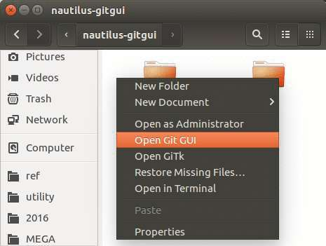
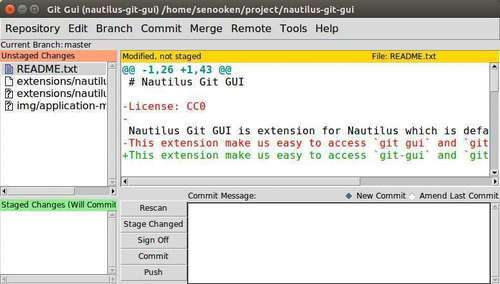
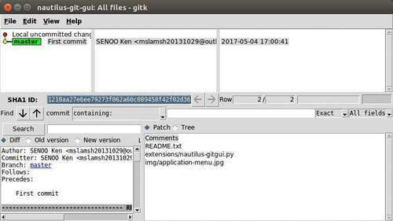

# Nautilus Git GUI

Nautilus Git GUI is extension for Nautilus which is default GNOME file manager.
This extension make us easy to access `git-gui` and `gitk` command in current directory.

Nautilus Git GUI adds following menu to application menu when right click in empty place.

* `[Run git gui]`: run `git gui` command in current direcotry.
* `[Run gitk]`: run `gitk` command in current directory.


## Screenshot





## Installation
1. Put or symlink `naitilus-git-gui.py` to  `$HOME/.local/share/nautilus-python/extensions/`. If you want to install all users, put it to `/usr/share/nautilus-python/extensions/`.

2. Restart nautilus.
```
nautilus -q
nautilus &
```


## Uninstallation
Delete `nautilus-git-gui.py` and `nautilus-git-gui.pyc` in following directory.
* `$HOME/.local/share/nautilus-python/extensions/`
* `/usr/share/nautilus-python/extensions/`


## Dependency
* Git
* GTK+
* Nautilus
* nautilus-python
* Python


## Attribution
* Auther: SENOO, Ken
* License: CC0
